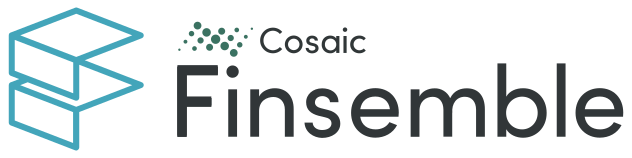

[](https://documentation.finsemble.com/)

# Finsemble Seed 🌱

## What is it?

Finsemble is a smart desktop platform that allows any type of application to
sync, link, and share information, even if they weren’t originally designed to.

Finsemble Seed is just that - a kernel packed with everything you need to grow
your own SmartDesktop and <del>rule the world</del> turbocharge your workflow.

## But really, what is it?

- If you're in a hurry, check out our
  [2 minute intro](https://www.youtube.com/watch?v=Y_CL7nrowL8)
- If you're developer and want the nitty-gritty details, check out our
  [talk at CovalenceConf 2020](https://www.youtube.com/watch?v=3dNzaNN3unA&t=377s).
- Once you've got the gist, checkout the
  [developer documentation](https://documentation.finsemble.com/) for the full
  details.

## Getting Started

1. 📡 Clone the repository.
   ```
   git clone https://github.com/chartiq/finsemble-seed
   ```
2. 📦 Install the deps

   (Note, we recommend using the [Yarn Package Manager](https://yarnpkg.com/) -
   it's fast and reliable. But you can also use npm.)

   ```
   cd finsemble-seed
   yarn install
   ```

3. 🚀 Start it!
   ```
   yarn start
   ```

Go ahead and take it for a spin!

When you're ready to go deeper, check out the check out the
[seed project tutorial](https://www.chartiq.com/tutorials/?slug=finsemble),
which will walk you through all the basics of building your SmartDesktop.

## What's Inside

The seed project bundles together a Webpack-based build system, a set of
bare-bones SmartDesktop components you can use as examples, and the necessary
config files to orchestrate it all. You can see a detailed breakdown of the
project structure [here](./ProjectStructure.md).

## The API, Please

Everything else there is to know about Finsemble and how to build on it can be
found in our [developer documentation](https://documentation.finsemble.com/).

## Getting Help

Having trouble? Perhaps we've covered it in the
[FAQ](https://documentation.finsemble.com/tutorial-FAQ.html).

Still having trouble? Shoot us a line at support@finsemble.com! We'll be happy
to help.

Prefer the easy-button? Our solutions engineers can integrate your apps together
in a POC faster than you can say "Desktop Interoperability". Schedule a
[demo](https://cosaic.io/contact)!
