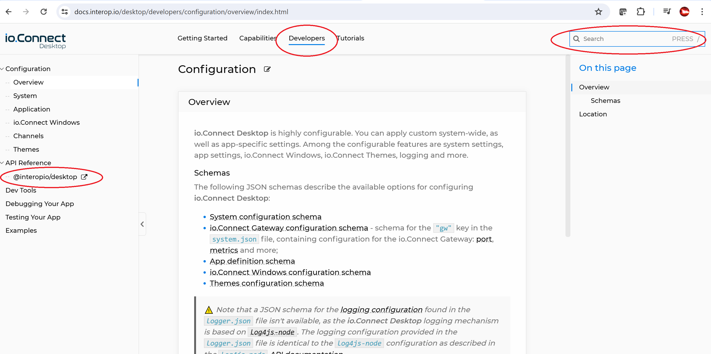

# IO.Connect Desktop Quick Start

This guide will get you going with IO.Connect Desktop (iocd) very quickly. It is intended for developers who are already understand the core concepts of desktop interop.

http://docs.interop.io contains the full product documentation. It's easy to find what you're looking for once you understand the navigation. The site is search-centric, so please make use of that search box and let us know if you can't find anything you're looking for.


_Note that there are four areas in the horizontal nav. Note the search box. The API Reference section will open a new window where you can navigate the API._

iocd does not require an initial project or repo (a.k.a. seed project). Simply install iocd with the installer executable that we provided. iocd will be installed in your "AppData/Local/interop.io/io.Connect Desktop" folder (your "install folder"). Make a note of this location because much of you development work will involve changing files within this folder. (If we sent you a zip, you can run io-connect-desktop.exe directly from that zip. iocd will still use the same AppData/.../io.ConnectDesktop folder for cache and user data.)

Once you've installed iocd, run it at least once from the start menu to ensure that it launches as expected. Note the floating "Launcher" that appears. This is where you launch apps, layouts (similar to Finsemble's workspaces but not to be confused with iocd's workspaces), manage settings, and shutdown or restart the system.

## Adding Apps

> Note: There is no prescribed way to build or host apps (the web pages or native apps that you wish to bring together into your desktop). You can build apps any way that you choose, and you can host them anywhere you like.

To add apps to iocd, add one or more json files to your install folder under "%LocalAppData\%\interop.io\io.Connect Desktop\UserData\%ENV-%REGION\apps". Each file should be an array of "app definitions". Each app definition must be in iocd format. The formats are slightly different for web apps vs. native apps. [Here is the json schema for that format](https://docs.interop.io/desktop/assets/configuration/application.json) and [here is documentation about app definitions](https://docs.interop.io/desktop/developers/configuration/application/index.html#app_definition).

> Adding app definitions to the "apps" folder is the quickest way to add apps, but it's probably not how you would do it in production. In production, you can use an [App Store](https://docs.interop.io/desktop/capabilities/app-management/overview/index.html#app_stores) so that iocd will make REST requests to your back end with the user credentials and your back end will return the app definitions for that user. Another approach is to use the [inMemoryStore API](https://docs.interop.io/desktop/reference/javascript/app%20management/index.html#InMemoryStore) and then writing code which adds apps dynamically.

Here's the most basic app definition. If this were a native app you would change `type` to "exe" and replace `url` with `command`.
```json
[{
    "title": "My App",
    "type": "window",
    "name": "my-app",
    "details": {
        "url": "https://mydomain.com/myapp",
        "mode": "tab"
    }
}]
```

## Enabling the API

Follow this pattern to use the iocd API within your web apps:

```typescript
import iocd, { IOConnectDesktop } from "@interopio/desktop";

const io = await iocd();

// `io` is a handle to the API. `IOConnectDesktop` contains all the types.
```

You can enable FDC3 in an app definition:

```json
{
    "title": "My FDC3 app",
    "type": "window",
    "name": "my-fdc3-app",
    "details": {
        "url": "https://mydomain.com/myfdc3app",
        "autoInjectFdc3": {
            "enabled": true
        }
    }
}
```

[Here's more documentation on configuring FDC3](https://docs.interop.io/desktop/getting-started/fdc3-compliance/index.html#fdc3_for_ioconnect_desktop-fdc3_library) which also describes how to specify intents. [Here's how to use an FDC3 AppD repository](https://docs.interop.io/desktop/getting-started/fdc3-compliance/index.html#fdc3_for_ioconnect_desktop-app_directory) instead of iocd's config.

## Using the API

[Here is the API Reference](https://docs.interop.io/desktop/reference/javascript/io.connect%20desktop/index.html#overview). It's a big API with a lot of functions. The API is object oriented so you should navigate the reference docs in an object oriented way (clicking on the return type of a function will often lead to more functions). For instance, [`iop.windows.my()`](https://docs.interop.io/desktop/reference/javascript/windows/index.html#API-my) returns a [IOConnectWindow](https://docs.interop.io/desktop/reference/javascript/windows/index.html#IOConnectWindow) object which then has member functions for manipulating that window.

> Please note that iocd function calls always throw exceptions when they encounter errors.

Here are the most common usages of the API.

### Exchange data between two apps

Use the [`interop`](https://docs.interop.io/desktop/reference/javascript/interop/index.html#API) API. It has a lot of functionality but the most common usage is for query/response.

_In your receiving app (aka server)_
```javascript

await iop.interop.register("your-topic-name", async (params) => {
    // do something with the params
    return { "hello" : "aloha" }
});
```

_In your sending app (aka client)_
```javascript
const { returned, all_errors } = await iop.interop.invoke("your-topic-name", { some, data, toSend });

// `returned` will contain { "hello" : "aloha" }
```

> `invoke()` does not accept primitives (number, string, etc). You must always send an _object_.
> If an exception is thrown in the receiving app then it will be received in the "all_errors" member of the sending app (but will not appear in the console of the receiving app.)

### Sharing data between apps

Use the ['context API`](https://docs.interop.io/desktop/reference/javascript/shared%20contexts/index.html#API) to share data between multiple apps. You can think of this as a "global store", like a database in iocd's memory that any app can access.

_Publish data to a global context_
```javascript
await iop.contexts.set("my-topic", { some, data, toPublish })
```

_Receive updated data whenever a global context is changed_
```javascript
await iop.contexts.subscribe("my-topic", (data) => {
    // React to the changes
});
```

> You cannot subscribe to a topic until it has been published. It's often a good idea to create a service (`autoStart: true, details.hidden: true`) to manage publishing.

> Use `update()` and `setPaths()` to make partial changes to a global context. Use `set()` to change the entire thing.

Use the [`channels API`](https://docs.interop.io/desktop/reference/javascript/channels/index.html#API) to share data between _linked_ apps (via color channels that the end user picks).

> If you use FDC3 then you don't need to implement the channels API.

The channels API behaves just like global context except that you use `channels.publish()` (publish() behaves just like `contexts.update()` because it is a "top level merge" rather than a replace).


### Starting an app

Apps appear in the launcher menu by default. Set `hidden:true` in an app definition to prevent it from being shown in the launcher.

Use the [appManager API](https://docs.interop.io/desktop/reference/javascript/app%20management/index.html#API) to launch apps programmatically.

_Launch an app_
```javascript

const result = await iop.appManager.application("my-app")?.start();

// `result?.window` contains a reference to the window for the new app
```

_Pass data to an app when launching it_
```javascript

const result = await iop.appManager.application("my-app")?.start({ data : "data", moreData: "moreData" });

// `result?.window` contains a reference to the window for the new app
```

_Receive that data in the launched app_
```javascript
const { context } = iop.windows.my();

// context will be { data, moreData }
```

> Note that you can also initialize the window context in the `context` field in the app definition JSON. This is a good place to put custom values that your application can access.
> An app can retrieve its full configuration with `iop.windows.my().application?.getConfiguration();`

### Manipulating windows

You can do all sorts of things with windows. You can move them. Resize them. Close them. An app can use `iop.windows.my()` to get a reference to its own window. Use `iop.windows.find(applicationName)` to get a window based on its application name (if there are multiple instances then you will only get one of them.). Use `iop.windows.findById(windowId)` to get a window by its specific window id (an "instance" of an app which is assigned by iocd).

> Note, window ids are assigned dynamically. A given window will have a different id every time iocd is restarted or when a layout is restored.

[Here is the full Window API](https://docs.interop.io/desktop/reference/javascript/windows/index.html#IOConnectWindow). For instance, `iop.windows.my().close()` will close the current window.

Use the `on****` functions to handle events.

_Take care of business before a window is closed_
```javascript
iop.windows.my().onClosing(async (prevent) => {
    prevent();
    // Do some business in here, then close the window.
    iop.windows.my().close();
});
```

## Changing system config

System config is in the "Desktop/config" subdirectory in your install folder. The file `system.json` is the most important. When developing, you can make changes directly to this file. Make a note of your changes though because if you re-install or upgrade iocd then your changes will be lost.

> Changes to UserData folder (like your layouts) are not lost when upgrading or reinstalling.

[Here is the json schema for system.json](https://docs.interop.io/desktop/assets/configuration/system.json)

In production, you would use one of several methods to make such system changes:

1) [Remote Configurations](https://docs.interop.io/desktop/getting-started/how-to/rebrand-io-connect/functionality/index.html#remote_configurations) allow you to serve system config from a REST server. The JSON from your REST server is merged into iocd's default values.

2) [Config Overrides](https://docs.interop.io/desktop/getting-started/how-to/rebrand-io-connect/functionality/index.html#environments__regions-shortcuts) are files containing config that are passed as command line parameters to iocd. These are merged just like remote configurations (but only system.json is supported).

3) [custom installer files](https://docs.interop.io/desktop/getting-started/how-to/rebrand-io-connect/installer/index.html#extensible_installer_example-basic_setup_files) can be used when creating an installer for your end users. These will completely replace the default configs.


### Login / SSO

To enable the login screen, add this to your system.json:

```json
{
    "ssoAuth": {
        "authController": "sso"
    }
}
```

Then, create a _web_ app named `sso-application`. This can be an application like any other.

This app will run during the "sso" stage of iocd's boot sequence. It should perform login tasks and then it must call `window.glue42gd.authDone()` (glue42gd is a global that is always available when running in iocd. You shouldn't use it often.) After calling authDone(), the system will continue booting (see [Remote Stores](#remote-stores-layout-prefs-apps)).

Common things to do during sso include (a) authenticating users, (b) setting global contexts or (c) setting default layouts. Most of the iocd API is available during this stage.

### Remote Stores (Layout, Prefs, Apps)

After sso is finished, iocd can contact various "stores" using REST to fetch data (via POST). Each of these stores receives the user credentials in the POST, so that you can return the right data for that user. You can also use our [io.Manager](https://docs.interop.io/manager/overview/index.html) product to handle this job so you don't need to build your own back end.

[App Stores](https://docs.interop.io/desktop/capabilities/app-management/overview/index.html#app_stores-rest) provide the list of apps that a user should be able to launch.

[Layout Stores](https://docs.interop.io/desktop/capabilities/windows/layouts/overview/index.html#layout_stores-rest) are used to save and restore a user's layouts (position of apps on the screen, context, etc)

[Preferences Stores](https://docs.interop.io/desktop/capabilities/app-preferences/overview/index.html#storage) are used to save and restore a user's "app preferences". (This can also be used as a generic _persistent_ data store.)

These stores are all configured in system.json. You can have multiple app stores, but only a single layout or preferences store.

> You can have one "system app store". This should contain apps that are available _before_ sso.

### Look and Feel

Much of the look and feel can be modified with various settings to [system.json](https://docs.interop.io/desktop/assets/configuration/system.json) or [stickywindows.json](https://docs.interop.io/desktop/assets/configuration/stickywindows.json).

> `groupType: "Web"` in stickywindows.json enables iocd's more recent "web groups" functionality. This replaces the older .NET based header (a.k.a. "window title bar") with a customizable, react based implementation. We recommend sticking with "web groups" unless you have serious memory constraints.

You can change system colors and fonts with the `injectedStyles` setting in system.json. This allows you to inject your own CSS file into all of iocd's UI.

```json
injectedStyles: {
    styles: [
        {
            url: "http://mydomain.com/yourcustomstyle.css"
        }
    ]
}
```

Most CSS is managed through css-variables. You can therefore override those variables to change appearance. It's recommended that you use Chrome devtools (F12) to determine what to change, but here are some common ones:

```css
--t42-tab-bar-background: ;
--t42-body-color: ;
--t42-tab-group-caption-background: ;
--t42-tab-bar-tab-background: ;
--t42-tab-bar-selected-tab-background: ;
--t42-standard-button-color: ;
--g42-font-family: ;
--g42-font-size: ;
```

## Customizing the UI

iocd's UI consists primarily of the launcher, dialogs, and webgroup app (window title bar). Each of these is a system app that can be pointed to your own implementation.

[Launcher](https://docs.interop.io/desktop/capabilities/launcher/index.html#custom_launcher). Set `embeddedShell: false` to stop iocd's default launcher. Then set `autoStart: true, shell: true` in the app definition for your replacement. You can then use iocd's API to build your perfect launcher.

[Web Groups](https://docs.interop.io/desktop/capabilities/windows/window-management/overview/index.html#extending_web_groups). To customize the window title bar you must create an app using the `@interopio/groups-ui-react` library. Give the app's definition `type: "webGroup"` and it will replace the system's version. (Note that you cannot specify different web group applications for different apps.)

[Dialogs](https://github.com/InteropIO/templates/blob/main/io-connect-desktop-components/src/components/Dialogs/Dialogs.tsx). Set `dialogs.url` in system.json to override dialogs.

[Here are all the templates](https://github.com/InteropIO/templates/tree/main/groups-react) for some of these UI apps.

> Note, many UI components are found in the "Desktop/assets" folder of your system install folder but do not have system.json urls to override. Instead, just replace these implementation within that folder.

## Deploying

You can deploy to your end users using iocd's installer, or you can handle deployment yourself. There are no registry entries required for deployment. Simply copy the io.connect folder to the appropriate location on your end users' desktops and then create shortcuts to io-connect-desktop.exe.

You can create your own installer by using iocd's [extensible installer](https://docs.interop.io/desktop/getting-started/how-to/rebrand-io-connect/installer/index.html#extensible_installer). This works by replacing the assets and configurations in the installer that we provided to you - for instance, giving you the ability to change icons, graphics and text on the installation dialogs, control where it's installed, and to replace default configs and assets.

> Note that after creating an installer using the extensible installer scripts you will need to sign the executable using signtool or some other mechanism.

The other way to deploy is using a "zip bundle." If you request a zip bundle, we will send you a zip file that contains a full iocd folder that can be copied to your end users' desktops (e.g. via global policy.) You would simply unzip the file, change your icons and system.json, then re-zip it and deploy.

## Debugging

Hit F12 on any window to bring up Chromium devtools. Hit shift-F12 to bring up devtools for the webgroup window (the window's title bar).

Hit F5 to refresh any window. iocd obeys http caching directives, so in development make sure that your devserver is configured for zero caching. Preloads will not be reloaded though, so if you make a change to a preload you must restart iocd.

> You can make changes to config on the fly. Any configs in the system directory, and any new apps added to a "file store" will automatically be picked up by iocd while it is running.

### Log files

"%LocalAppData\%\interop.io\io.Connect Desktop\UserData\%ENV-%REGION\logs" is the primary tool when something goes wrong. If you're reporting an issue, please always include your application.log in the report. Often, you can self-diagnose problems by searching for "[ERROR]" or "[WARN]" in the log. Or if you're having an issue with a particular app, search for that app's name.

When your own apps use the [`iop.Logger`](https://docs.interop.io/desktop/reference/javascript/logger/index.html#API) API, the logs will appear in the "logs/applications" subdirectory.

### Other files

Chromium's cache is located in the "Cache" subdirectory of your install folder. There will be a unique cache for each version of iocd that you installed. You can delete these caches if necessary.

Default "file stores" for apps, layouts, and prefs are in the corresponding folders in "%LocalAppData\%\interop.io\io.Connect Desktop\UserData\%ENV-%REGION". These are human readable JSON and can be analyzed or modified for debugging purposes.

The "Instances" folder in your install folder contains information about any running instances. This can be used to determine which port iocd has opened for its gateway (the gateway is how apps communicate with each other - via websockets).
