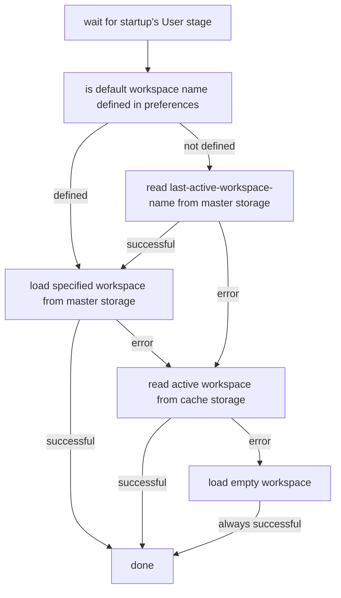

# Remotely Persisted Workspaces

## Requirements Summary

The below summarizes the requirements, with the specification section clarifying the details.

1. A Finsemble user must be able to share and update though a global storage adaptor the same workspace across multiple
   computers. For example, if a user saves their workspace from their work desktop, they can later load and update the
   saved workspace from their home desktop.

1. On startup, Finsemble must return to the last used active workspace, even when working across multiple computers. For
   example, if the user’s last active workspace is “Workspace A” (running on their work desktop), then starting
   Finsemble at home will come up with “Workspace A” (even if “Workspace B” was the last workspace used at home).

1. Finsemble must limit the frequency of saving workspace data to master storage -- this is an essential underlying
   requirement for saving workspaces across machines using cloud-based storage adapters.

## Specifications

1. The workspace service must only write to the master storage when the workspace is explicitly saved by the end user.
1. The workspace service must only read from the master storage when the workspace is loaded.
1. The last active workspace name must be saved in master storage each time a workspace is loaded.
1. On startup if a default workspace isn’t specified in preferences, then the last active workspace name must be read
   from master storage to determine the initial workspace to load.
1. The integrity of the workspace definition in master storage must be maintained (i.e. storage writes must not leave a
   workspace definition is an inconsistent state if possible).
1. If there is an error reading master storage on startup, then a user notification must be issued and the active
   workspace read instead from cache storage.
1. If there is an error reading active-workspace on startup, after a master storage error, then a user notification must
   be issued and the empty workspace loaded.
1. If there is an error writing to the master storage, then a user prompt must be issued, giving the choice to continue
   without writing (losing changes) or stop the current operation (i.e. a switch or a shutdown).
1. If there is an error reading master storage on a switch operation, then a user notification must be issued and the
   switch terminated, leaving the active workspace unchanged.

## Startup Flow for Opening Initial Workspace

## Caveats

1. Multiple users concurrently sharing the same Finsemble account and workspaces from different computers is not
   supported because of extra underlying synchronization requirements -- each user must have their own account and
   actively use one machine at a time (staying logged in at work while working from home is allowed).
2. If a user is logged into multiple machines and moving between them, then changes made one machine won't be reflected
   on the other until a workspace reload is done. Also, if changes are made to the active workspaces on both machines
   without saving, then there is the potential to lose changes from one of the machines when later saving.
3. The above assumes no programmatic reading/writing of the remote workspace, either by client devs or by Finsemble code
   outside of the workspace service.
