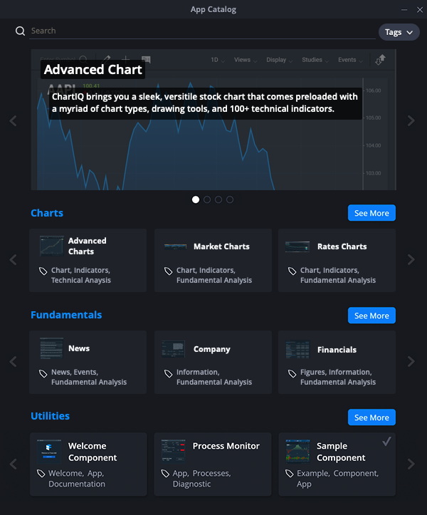

# Finsemble App Catalog

The app catalog is launched from the toolbar. With the app catalog, you can search and filter
across all available applications, adding the most relevant applications to your app launcher
menu for daily use. Applications are tagged with metadata to make filtering and searching easy.
* Featured Apps Carousels: The app catalog helps direct your attention to the best
applications. The Featured Apps section of the catalog shows a rotating selection of
relevant applications.
* App Showcase: The App Showcase section displays detailed information about a
particular application, including a description, release notes of the latest version, release
date, version number, the developer's name, and associated tags.

