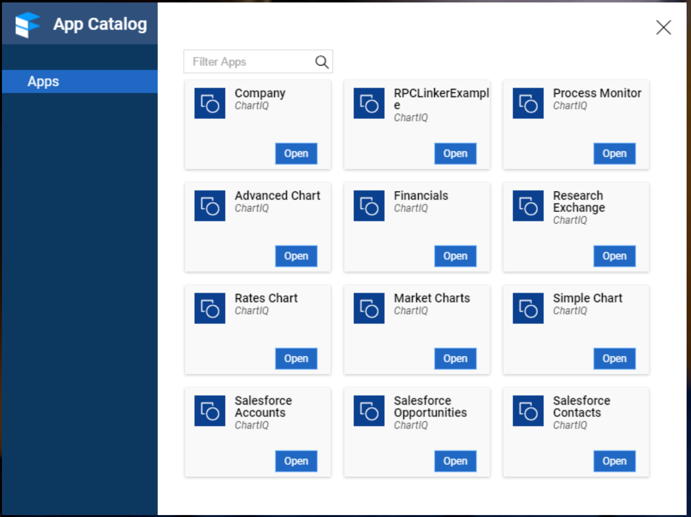

## AppLauncher

### Overview

This is a menu that will launch components. It filters components based on a "mode" property in the component's config. This may be revisted in the future.

### What it looks like

### Controls used

The controls used in this component are documented over in our Finsemble React Controls repo:

- [FinsembleMenu](https://github.com/ChartIQ/finsemble-react-controls/tree/master/FinsembleMenu)
- [FinsembleMenuSection](https://github.com/ChartIQ/finsemble-react-controls/tree/master/FinsembleMenuSection)
- [FinsembleMenuSectionLabel](https://github.com/ChartIQ/finsemble-react-controls/tree/master/FinsembleMenuSectionLabel)
- [FinsembleMenuItem](https://github.com/ChartIQ/finsemble-react-controls/tree/master/FinsembleMenuItem)
- [FinsembleMenuItemLabel](https://github.com/ChartIQ/finsemble-react-controls/tree/master/FinsembleMenuItemLabel)
- [FinsembleMenuItemActions](https://github.com/ChartIQ/finsemble-react-controls/tree/master/FinsembleMenuItemActions)
- [FinsembleMenuItemAction](https://github.com/ChartIQ/finsemble-react-controls/tree/master/FinsembleMenuItemAction)
