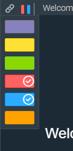
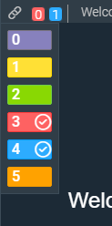

# Linker Window

## Overview
The Linker Window is our sample system component that interfaces with the Linker Service. It is used to add or remove a Finsemble component from a group. Check out [Linking Components](http://documentation.chartiq.com/finsemble/tutorial-Linking.html) for more information. The Linker is launched from the Window Title Bar. 

## How It Works
- When the user clicks on the channel color to update the window's channels, the Linker Window uses the LinkerClient API to update the channels and hides itself.

## What it looks like

# Accessible Linker Window
To enable the accessible version of the Linker window (with text rendered on channel markers for colorblind users), set `finsemble.accessibleLinker = true` in your configuration (which could also be set by a user through an extension to the UserPreferences component).

## What it looks like

