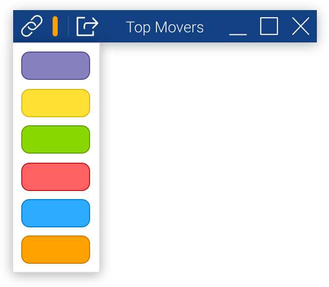

# Linker Window

## Overview
The Linker Window is our sample system component that interfaces with the Linker Service. It is used to add or remove a Finsemble component from a channel. Check out [Linking Components](http://documentation.chartiq.com/finsemble/tutorial-linkingComponents.html) for more information. The Linker is launched from the Window Title Bar. 

## How It Works
- The Window Title Bar calls `LinkerClient.openLinkerWindow()` which sends a router query on the "Finsemble.LinkerWindow.Show" channel with the window's channels, windowIdentifier and windowBounds.
- The Linker Window then updates its display using that information and opens up at the proper position:
	```javascript
	finWindow.showAt(data.windowBounds.left, data.windowBounds.top + 20, function() {});
	```
- When the user clicks on the channel color to update the window's channels, the Linker Window uses the LinkerClient API to update the channels and hides itself.

## What it looks like



