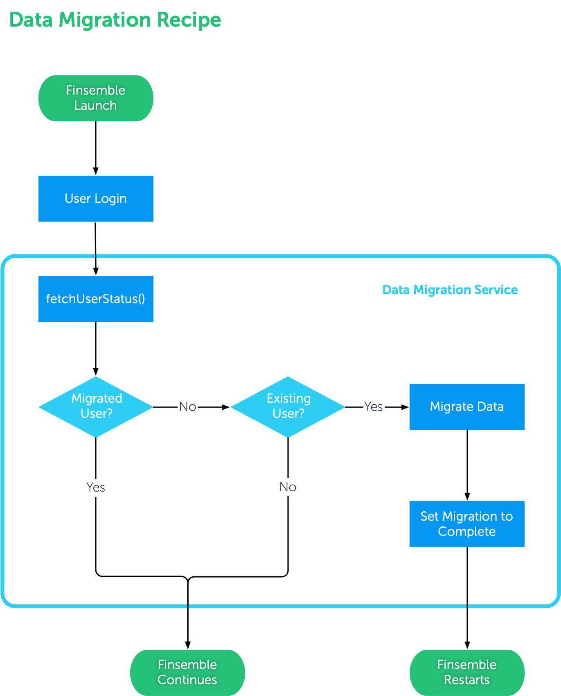

[](https://documentation.chartiq.com/finsemble/)

# Finsemble Recipe: Workspace Migration

When the Finsemble component configuration changes and a componentType is added or removed, existing workspaces may be affected and also require changes to remain working.
This recipe, with appropriate modifications, can handle the migration of workspace data for your users.


## Ingredients

This recipe contains a service and a component to assist in setting up a migration workflow. Here are the provided files in the `src` directory of this branch:

```
src
├── adapters
├── clients
├── components
│   └── workspacemigration
│       ├── config.json
│       ├── finsemble.webpack.json
│       ├── workspacemigration.css
│       ├── workspacemigration.html
│       └── workspacemigration.js
├── services
│   └── workspaceDataMigration
│       ├── README.md
│       ├── config.json
│       ├── workspaceDataMigrationService.html
│       ├── datamigration.png
│       └── workspaceDataMigrationService.js
└── thirdParty
```


### Service: `workspaceDataMigration`

**Flowchart**




1. If the user's data has already been migrated, the Migration Assistant component should not spawn.
1. Otherwise, a simple message displays with warning copy and action buttons.
1. Upon completion of a migration, the Migration assistant can be clsoed.

### Workspace Migration Assistant Component: `workspacemigration`

The Migration Assistant component is a basic HTML5 component designed to communicate with the user about the migration. This component is a sample and is designed to be customized to your needs. It is not an essential part of the migration process, other than having a button to start the process. Hence, it may be removed or edited such that the migration is conducted automatically. However, at the end of the migration the current workspace must be reloaded; the migration assistant is therefore useful in grabbing the user's attention while that happens so that they do not interact with the workspace before ti is reloaded

## Directions

1. Copy the `src/services/workspaceDataMigration` directory from this branch in your Finsemble `src/services` directory.

1. Copy the `src/components/workspacemigration` directory from this branch to your Finsemble `src/components` directory.

1. Modify `src/services/datamigration/workspaceDataMigrationService.js` to define or customize the migration operation. 
    1. Set the `MIGRATION_NAME` variable to a suitable value which will be used as a storage adapter key that will help determine if the migration has been run or not.

    1. Determine if the default migration procedure will work for you. It is based on checking a source field in each `windowData` object in each workspace for known values, which are then used to retrieve a set of changes to make to the `windowData` object. It is expected that this procedure will handle the majority of workspace data migration needs, however, other cases are possible.
        - If the procedure is appropriate:
            - update the `MIGRATION_SOURCE_FIELD` to the path and name of the variable in each `windowData` object in each workspace that will provide the value to check. We use [lodash.get](https://lodash.com/docs/4.17.15#get) to retrieve the value, hence, you may enter a path, e.g. `customData.component.type`. The variable should point to a JSON value (rather than an Object or an Array), e.g. a component type name or window name.
            - update `MIGRATION_SOURCE_TO_DESTINATION_VALUE_MAP` Object to map values of the indicated `MIGRATION_SOURCE_FIELD` to an Object defining changes to make to the `windowData` Object. The changes are defined as key (variable name and path) value pairs. 
                E.g.
                ``` 
                "Welcome Component": {
                    "componentType": "Process Monitor", 
                    "customData.component.type": "Process Monitor"
                }
                ```
                indicates that windowData objects with a `MIGRATION_SOURCE_FIELD` value of 'Welcome Component' should have both the `componentType` and `customData.component.type` fields set to value 'Process Monitor'. We use [lodash.set](https://lodash.com/docs/4.17.15#set) to set the values given, see the releevant lodash docs for valid ways of specifying the path (within each `windowData` Object) to the variable to set.
        - If you need a different migration procedure, re-implement the `migrationRequired()` and `migrateWindow()` functions of the example migration to process individual windows in workspaces appropriately OR re-implement the `migrateWorkspace()` function to modify how the entire workspace is handled.

1. In the  `finsemble.importConfig` array of your [manifest](https://documentation.chartiq.com/finsemble/tutorial-Configuration.html) or _/configs/application/config.json_ file to  include references to the component and service `config.json` files:
    
    ```json
    "importConfig": [
        ...
        "$applicationRoot/components/workspacemigration/config.json",
        "$applicationRoot/services/workspaceDataMigration/config.json",
        ...
    ],
    ```
1. Install if needed and start Finsemble: `npm install; npm run dev`.

1. After the user is authenticated, the WOrkspace Migration Assistant component will or will not display as per the logic from the service, as above.

**Please Note** that after the migration has been run the timestamp at which it was run will be saved via the SotrageClient in the `finsemble` topic using the `MIGRATION_NAME` as the key. In the event that you need to re-run the migration, this key/value pair will need to be deleted from the relevant storage adapter. By default, this is `IndexedDb` and hence the key can be deleted via the 'Application' tab of the Javascript Inspector for any Finsemble window on the `$applicationRoot` domain (e.g. open the Javascript Inspector on the Toolbar). 

## Example Migration ##
This recipe is configured by default to convert any instances of the seed project's `Welcome Component` into `Process Monitor` components. Hence, it is based on the component type of each window in the workspace and re-writes the values of several other fields based on it. To test it, simply create workspace or workspaces with `Welcome Component` in them, quit, enable the migration and restart. If the migration has already been run once, 

## Warning ##

Note that this recipe is **a destructive migration** in that it overwrites the workspaces that it migrates. Hence, please be sure to test your migration extensively before applying it to your user's data and/or modify the migration to create backups of the migrated workspaces.